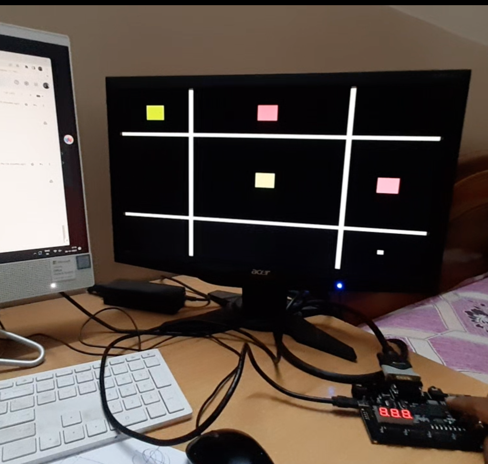

#### Authors:
######## Debasmit Roy

# Tic-Tac-Toe game in Mimas V2 Spartan 6 FPGA Development Board
# Xilinx ISE
##### To generate the .bin file goto ./tic-tac-toe directory.
##### Fetch the MimasV2TopModuleLX9.vhd, MimasV2VGADisplay.vhd, VGAOut.vhd and clocking.vhd module.
##### Modify the .ucf file according to the Development Board you are using.
##### Output

BOARD DOCUMENTATION: https://numato.com/product/mimas-v2-spartan-6-fpga-development-board-with-ddr-sdram/

